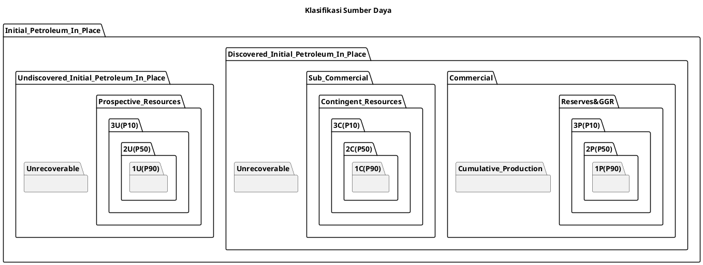
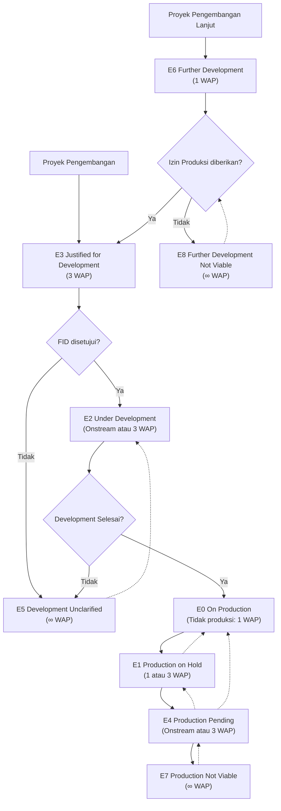
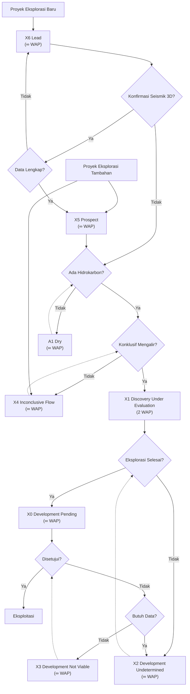
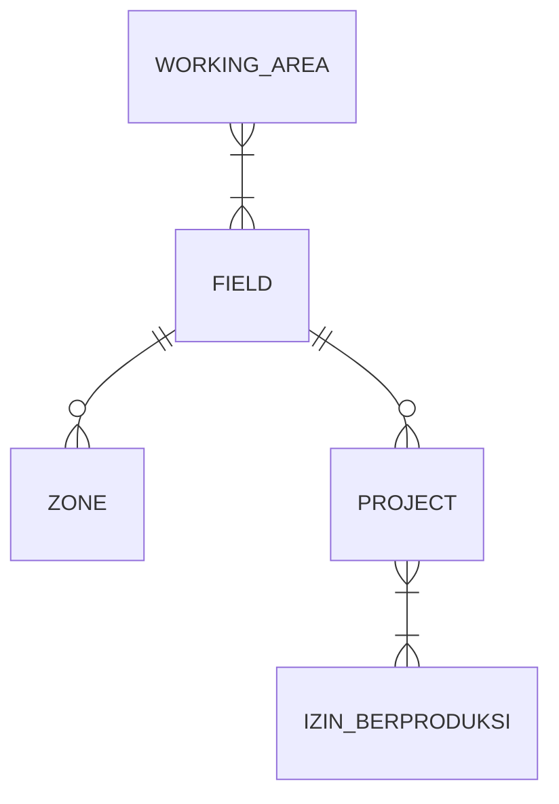

# Indonesia Framework of Petroleum Resources

## Kata Pengantar

Industri hulu Migas Indonesia sudah berumur seratus tahun lebih, dimulai dengan eksplorasi sistemik pertama di tahun 1865, dan pengeboran sumur eksplorasi pertama, Sumur Madja-1/Cibodas Tonggoh-1 di Majalengka pada tahun 1871, serta penemuan pertama di tahun 1885 dengan ditemukannya lapangan Telaga Said di Sumatera Utara. Hingga kini, lebih dari 26 milyar barel minyak telah diproduksi dari perut bumi Indonesia, menjadi tulang punggung pembangunan Indonesia, terutama pada fase awal pembangunan negara ini. 

Proyek-proyek gas besar mulai berjalan pada awal 1970-an dengan ditemukannya Lapangan Badak dan Lapangan Gas Arun, pionir teknologi LNG dan EOR Steam-flood Lapangan Duri yang menjadi referensi dunia. Kontribusi proyek-proyek ini sangat besar bagi perekonomian Indonesia, mendukung pembangunan untuk kemakmuran rakyat Indonesia.

Saat ini, pemerintah mencanangkan target satu juta barel minyak per hari sebagai target jangka panjang. Oleh karena itu, pemerintah dan pemangku kepentingan perlu membangun dan mengawal proyek-proyek yang mampu meningkatkan produksi nasional. Penting untuk mengetahui estimasi sumber daya migas secara umum dan tingkat kematangan proyek-proyek tersebut sebagai strategi pengelolaan proyek-proyek migas untuk meningkatkan cadangan dan produksi migas Indonesia.

Klasifikasi ini dibuat berdasarkan proses bisnis pengelolaan proyek dan standar klasifikasi sumber daya internasional, yaitu Petroleum Resources Management System (PRMS), dengan pembaruan terbaru pada PRMS 2018. Sub Tim Standardisasi Kerangka Sumber Daya Migas Indonesia juga berdiskusi dan berkoordinasi dengan berbagai stakeholders, termasuk regulator, lembaga pengawas, institusi penelitian, universitas, pelaku bisnis, konsultan sertifikasi, dan para pakar perminyakan.

Bersamaan dengan terbitnya pedoman ini, sistem pelaporan elektronik juga diperbarui agar sesuai dengan referensi terbaru. Diharapkan pedoman ini dapat memberikan informasi aset migas Indonesia yang lebih komprehensif dan mendukung pengelolaan sumber daya migas secara efektif.

Ketua Sub Tim Standardisasi Kerangka Sumber Daya Migas Indonesia  
**Ir. Wilson Robert Pariangan, M.T., SPEC**

---

## Ucapan Terima Kasih

Penyusunan standardisasi membutuhkan kolaborasi agar standar yang disusun dapat diterima oleh semua pihak. Organisasi Society of Petroleum Engineers (SPE) menciptakan standar yang menjadi acuan dunia, yaitu Petroleum Resources Management System (PRMS). Standar ini disesuaikan agar sesuai dengan filosofi, hukum, dan regulasi di Indonesia tanpa menghilangkan prinsip utama dalam PRMS.

Penyusunan Kerangka Sumber Daya Migas Indonesia ini didasari pada pandangan dari berbagai stakeholders di industri hulu minyak dan gas bumi di Indonesia. Kolaborasi menjadi tema penting dalam menyusun pedoman ini. Kami berterima kasih kepada banyak pihak yang telah berkontribusi melalui diskusi formal sehingga naskah ini dapat tersusun secara komprehensif.

**Penyusun Naskah**  
**Dr. Ir. Fajril Ambia, PMP, SPEC**

---

## Daftar Isi

1. Pendahuluan  
2. Prinsip Dasar dan Definisi  
   - Kerangka Klasifikasi Sumber Daya  
   - Evaluasi Sumber Daya Berbasiskan Proyek  
3. Ketidakpastian dan Risiko Sumber Daya  
   - Rentang Ketidakpastian Teknis  
   - Sistem Petroleum dan Penentuan GCF (Geological Chance Factor)  
4. Panduan Evaluasi dan Pelaporan  
   - Faktor Komersial  
   - Perkiraan Volume dalam Pelaporan Sumber Daya  
   - Kodifikasi Entitas Bawah Permukaan  

---

## I. Pendahuluan

Sumber daya minyak dan gas bumi adalah portofolio penting bagi negara. Nilai sumber daya ini menjadi acuan untuk kebijakan, investasi, dan strategi pengembangan lapangan. Namun, angka sumber daya adalah angka perkiraan yang memiliki tingkat kematangan, risiko, dan ketidakpastian berbeda.

Ditjen Migas melalui SKK Migas dan BPMA melakukan pelaporan tahunan terhadap angka sumber daya yang dimiliki Kontraktor Kontrak Kerja Sama (KKKS). Setelah pelaporan selesai, Ditjen Migas bersama SKK Migas dan BPMA mengevaluasi angka sumber daya yang dilaporkan KKKS. Hal ini menunjukkan pentingnya angka sumber daya dalam penentuan kebijakan nasional.

Untuk menyamakan persepsi atas angka sumber daya, diperlukan standar definisi. PRMS menjadi acuan utama, yang kemudian disesuaikan dengan regulasi dan proses bisnis industri hulu migas di Indonesia.

---

## II. Prinsip Dasar dan Definisi

Prinsip utama dalam standar ini adalah membangun klasifikasi atas akumulasi minyak dan gas bumi pada reservoir yang dikelola dalam sebuah proyek.

>**Definisi II.1: Proyek**
>
> Proyek didefinisikan sebagai kerangka kegiatan yang antara lain mencakup proses pencarian dan evaluasi akumulasi petroleum, penentuan strategi pengembangan yang dapat memproduksikan sejumlah volume petroleum secara komersial, penetapan keputusan investasi yang perlu diambil, hingga seluruh kegiatan produksi.

Proyek dapat dimulai dari kegiatan eksplorasi yang berupaya meningkatkan geological chance factor (lihat Definisi III.6) yang bertujuan untuk menemukan sumber daya migas baru, pembuatan strategi pengembangan lapangan tertentu, atau aktivitas eksploitasi maupun enhanced oil recovery (EOR) yang dapat meningkatkan produksi. Terlepas dari berbagai jenis kegiatan yang ada, setiap proyek harus memiliki tujuan akhir berupa produksi. Dengan demikian, lingkup kegiatan dalam proyek merupakan kerangka kegiatan yang membutuhkan izin berproduksi dari pihak yang berwenang.

> **Definisi II.2: Izin Berproduksi**
>
>Izin berproduksi adalah istilah umum yang digunakan dalam dokumen ini untuk merujuk pada berbagai izin yang diberikan oleh pihak yang berwenang kepada KKKS agar dapat berproduksi. Izin berproduksi dapat berupa Persetujuan POD, POP, Surat Keputusan Menteri, dan sebagainya.

Pada tahapan eksplorasi, apabila area proyek tersebut tidak seluruhnya mendapatkan izin berproduksi, maka proyek tambahan terpisah dapat dibuat untuk melanjutkan kegiatan eksplorasi di area yang belum mendapatkan izin berproduksi. Proyek tambahan ini nantinya akan dievaluasi untuk mendapatkan izin berproduksi yang baru sebelum bisa dikembangkan.

Proyek juga dapat dibentuk sebagai pengembangan lanjutan atas proyek yang telah ada. Konsep kerangka kegiatan yang terdapat dalam proyek lanjutan ini juga harus berujung pada permintaan izin berproduksi yang baru. Apabila kerangka kegiatan tersebut tidak membutuhkan izin berproduksi yang baru, maka cukup merevisi proyek yang sudah ada.

> **Definisi II.3: Risiko**
>
>Risiko (risk) merupakan probabilitas atas suatu kejadian (event) yang memiliki keluaran (outcomes) bersifat dapat dicacah (countable). Risiko dapat berupa risiko teknis maupun risiko komersial. Risiko teknis umumnya lebih dominan pada kegiatan eksplorasi, sedangkan risiko komersial umumnya lebih dominan pada kegiatan pengembangan.

Pada kegiatan eksplorasi, terdapat dua kemungkinan kejadian, yaitu berhasil atau gagal menemukan akumulasi petroleum. Oleh karena itu kegiatan eksplorasi disebut memiliki risiko. Risiko terbesar pada tahapan eksplorasi adalah risiko geologi. Risiko geologi dapat dikuantifikasi dengan metode statistik sehingga analisa risiko bisa dilakukan secara objektif.

> **Definisi II.4: Ketidakpastian**
>
> Ketidakpastian (uncertainty) merupakan probabilitas atas suatu kejadian (event) yang memiliki keluaran (outcomes) bersifat tidak dapat dicacah (uncountable). Ketidakpastian terdapat pada angka sumber daya yang diperoleh apabila keberadaan akumulasi petroleum sudah dikonfirmasi.

Klasifikasi yang dibangun dalam standar ini merujuk kepada level kematangan proyek (Project Maturation) yang merefleksikan peluang keberhasilan proyek dari sisi komersial. Selain itu, dalam klasifikasi tersebut terdapat pula ketidakpastian dari sisi teknis yang menyebabkan ketidakpastian besaran sumber daya. Keseluruhan risiko dan ketidakpastian ini tercermin dalam klasifikasi yang dibangun, sehingga peluang keberhasilan komersial dari proyek serta ketidakpastian angka sumber daya dapat tergambar dari posisi dalam klasifikasi tersebut.

> **Definisi II.5: Waktu Acuan Pelaporan (WAP)**
>
> Waktu Acuan Pelaporan (WAP) adalah waktu referensi tahunan yang ditetapkan pada setiap tanggal 31 Desember Pukul 23.59. Status WAP ditulis dalam bentuk 31.12.20XX dengan XX merupakan tahun status data ditetapkan. Untuk penulisan yang lebih singkat, status WAP dapat ditulis bagian tahun saja (20XX). Sebelum penetapan dokumen ini, waktu referensi yang digunakan adalah setiap tanggal 1 Januari Pukul 00.00 tahun setelahnya, atau biasa ditulis dalam format 1.1.20XY dengan XY merupakan XX + 1.

Proses evaluasi terhadap data yang ada pada proyek dihitung pada saat WAP. Waktu referensi ini menjadi acuan dalam berbagai definisi yang ada pada dokumen ini.

> **Definisi II.6: Petroleum**
>
> Petroleum didefinisikan sebagai campuran yang umumnya didominasi oleh komponen hidrokarbon yang secara alami terbentuk dalam fase padat, cair, maupun gas. Petroleum dapat mengandung komponen non-hidrokarbon yang biasa menyertai dalam akumulasi tersebut, seperti karbon dioksida, nitrogen, hidrogen sulfida, dan sulfur. Dalam beberapa kasus khusus, komponen non-hidrokarbon dapat menjadi komponen yang paling dominan.

 Pengecualian dominasi komponen hidrokarbon umumnya terjadi apabila volume petroleum sangat besar sehingga walaupun hidrokarbon yang tersedia tidak dominan, hidrokarbon tersebut masih berpotensi untuk memiliki nilai komersial.

> **Definisi II.7: Initial Petroleum in Place (IPIP)**
>
> Initial Petroleum in Place (IPIP) adalah akumulasi petroleum yang secara alami terdapat pada reservoir dalam kondisi awal sebelum adanya produksi. Akumulasi ini dihitung secara keseluruhan sehingga termasuk baik yang dapat diambil maupun yang tidak dapat diambil. Jenis Petroleum in Place adalah Initial Oil in Place (IOIP) dan Initial Gas in Place (IGIP). Untuk volume awal kondensat pada retrograde condensate reservoir apabila sebelum diproduksikan sudah terbentuk kondensat di reservoir, maka volume tersebut dimasukkan ke dalam volume IOIP, sedangkan untuk saturated reservoir yang memiliki gas tudung sebelum reservoir diproduksikan, maka volume gas tudung tersebut dimasukkan ke dalam volume IGIP.

> **Definisi II.8: Sumber Daya**
>
> Sumber daya adalah bagian dari Initial Petroleum in Place (IPIP) yang berpotensi untuk diambil ke permukaan melalui kegiatan pengeboran atau mekanisme lain yang didukung oleh fasilitas produksi yang diperlukan. Sumber daya dapat dievaluasi pada IPIP yang belum maupun yang sudah ditemukan. Seluruh kelas dalam klasifikasi disebut sebagai sumber daya.

 Sesuai dengan Definisi II.8, akumulasi petroleum yang secara alami terbentuk dalam kerak bumi dan berpotensi untuk diambil disebut sumber daya, baik yang sudah maupun yang belum ditemukan. Adapun cadangan adalah sumber daya yang sudah ditemukan dan telah memenuhi seluruh syarat-syarat komersial. Dengan demikian, bisa dinyatakan bahwa cadangan merupakan kasus khusus dari sumber daya. Cadangan didefinisikan lebih detail pada Definisi II.9.

 Faktor komersial yang menjadi pertimbangan dalam penentuan klasifikasi didasarkan pada faktor teknis, keekonomian, regulasi dan legal, serta sosial dan lingkungan. Perlu ditekankan bahwa faktor teknis merupakan bagian dari komersial. Oleh karena itu penetapan kelas cadangan pada proyek bermakna bahwa proyek tersebut sudah memiliki peluang keberhasilan yang tinggi terhadap faktor-faktor komersial.

### II.1 Kerangka Klasifikasi Sumber Daya

Klasifikasi ini merupakan sistem yang mengategorikan proyek migas di Indonesia. Dengan klasifikasi tersebut, para pemangku kepentingan dapat membuat berbagai strategi untuk meningkatkan level proyek dari sumber daya hingga mencapai kelas cadangan.

Klasifikasi Sumber Daya

> **Definisi II.9: Cadangan (Reserves)**
>
> Cadangan (Reserves) adalah bagian volume IPIP yang diperkirakan dapat diambil secara komersial melalui kegiatan dalam proyek pengembangan yang telah ditetapkan. Penetapan jumlah cadangan ditentukan berdasarkan sisa akumulasi petroleum yang dapat diambil saat WAP. Faktor komersial yang menjadi batas adalah faktor teknis, keekonomian, regulasi dan legal, serta faktor sosial dan lingkungan.

> **Definisi II.10: GOI Recoverable Resources (GRR)**
>
> GOI Recoverable Resources (GRR) merupakan bagian volume IPIP yang diperkirakan dapat diambil dengan dibatasi hanya faktor teknis saja. Faktor teknis didasarkan pada kemampuan maksimal sumur dan fasilitas produksi yang sudah terpasang sesuai dengan skenario teknis yang digunakan pada definisi cadangan dengan tetap memperhatikan prinsip-prinsip good engineering practices. Pada kasus-kasus tertentu, batasan faktor teknis dapat didasari pada konsep rencana kegiatan yang menjadi baseline dalam skenario pengembangan. Selisih volume GRR dan cadangan merupakan volume yang memiliki potensi untuk menjadi cadangan apabila kendala komersial dapat diatasi. Penetapan jumlah GRR ditentukan berdasarkan sisa akumulasi petroleum yang dapat diambil saat WAP.

Konsep GRR analog dengan konsep Technically Recoverable Resources (TRR) yang diperkenalkan dalam PRMS 2018. Namun perbedaan utama adalah definisi GRR memiliki batasan yang lebih spesifik dibandingkan TRR sesuai dalam Definisi II.10. Karena GRR berada dalam kelas yang sama dengan cadangan, maka volume GRR tidak dapat dilaporkan sendiri tanpa nilai cadangan. Sehingga pencatatan angka cadangan selalu disertai dengan angka GRR.

> **Definisi II.11: Contingent Resources**
>
> Contingent Resources merupakan bagian volume IPIP yang diperkirakan dapat diambil berdasarkan proyek yang ditetapkan dengan dibatasi oleh faktor teknis. Proyek yang berada dalam kelas contingent resources mengalami kendala dari sisi komersial. Umumnya, masalah utama terletak pada faktor keekonomian, regulasi dan legal.

> **Definisi II.12: Prospective Resources**
>
> Prospective Resources merupakan bagian volume undiscovered IPIP yang diperkirakan dapat diambil. Volume ini diidentifikasi saat kegiatan eksplorasi. Prospective Resources memiliki asosiasi dengan geological chance factor sehingga umumnya keberadaan akumulasi petroleum belum dapat ditentukan secara pasti. Perpindahan kelas menjadi Contingent Resources baru dapat terjadi jika proyek tersebut mendapatkan level Discovery under Evaluation.

Klasifikasi dalam standar ini bisa dibagi menjadi tiga kelas, yaitu cadangan & GRR, contingent resources, dan prospective resources. Setiap proyek hanya dapat memiliki satu kategori kelas. Kategori cadangan dan GRR berada dalam satu kelas yang sama karena konsep GRR didesain untuk menangkap besaran volume yang bisa diambil apabila secara umum hanya mempertimbangkan faktor teknis saja. Tujuan dari kategori GRR ini adalah antara lain agar negara dapat menentukan strategi kebijakan yang diambil terhadap wilayah kerja yang akan berakhir. Karena kategori cadangan berada pada kelas dan GRR yang sama, maka tiap proyek yang sudah memenuhi persyaratan komersial pasti memiliki kedua nilai tersebut.

> **Definisi II.13: Cumulative Production atau Produksi Kumulatif**
>
> Cumulative Production atau Produksi Kumulatif adalah angka produksi aktual yang diakumulasi dari saat awal produksi hingga WAP.

> **Definisi II.14: Unrecoverable**
>
> Unrecoverable, merupakan bagian volume IPIP yang ketika dievaluasi pada status waktu acuan, tidak dapat diambil akibat terkendala dari sisi teknologi maupun batasan fisika yang dihadapi oleh proyek. Sebagian dari volume yang tidak dapat diambil ini dimasa datang dapat menjadi terambil apabila ada proyek pengembangan lanjut yang dapat menyelesaikan kendala-kendala tersebut.

> **Definisi II.15: Estimated Ultimate Recovery (EUR) atau Perkiraan Pengambilan Maksimum**
>
> Estimated Ultimate Recovery (EUR) atau Perkiraan Pengambilan Maksimum adalah volume petroleum yang bisa diambil secara keseluruhan dari awal hingga akhir masa produksi. Volume EUR bergantung pada konteks batasan yang diambil. Jika batasan yang diambil mengambil batasan yang ada pada cadangan, maka EUR disebut sebagai Ultimate Reserves. Namun jika merujuk volume GRR, maka EUR disebut Ultimate GRR.

Secara matematis, EUR untuk tiap kelas dapat ditulis dengan persamaan berikut:

>EUR = Ultimate Reserves = Cumulative Production + Reserves
EUR = Ultimate GRR = Cumulative Production + GRR  
EUR = Cumulative Production + Contingent Resources
EUR = Prospective Resources

Dengan demikian, untuk tiap akumulasi petroleum akan memenuhi hubungan berikut:

> Discovered IPIP = Cumulative Production + Reserves + Contingent Resources + Unrecoverable

Perlu ditekankan kembali apabila hanya terdapat satu proyek yang ada untuk menguras akumulasi tersebut, maka persamaan di atas hanya dapat memiliki cadangan atau contingent resources, namun tidak keduanya. Karena dalam satu proyek tidak dapat memiliki dua kelas yang berbeda.

 Untuk fase eksplorasi, akumulasi petroleum akan memenuhi hubungan berikut:

> Undiscovered IPIP = Prospective Resources + Unrecoverable

### II.2 Evaluasi Sumber Daya Berbasis Proyek

Penetapan nilai sumber daya dalam suatu proyek dihitung berdasarkan pada akumulasi petroleum yang diperoleh melalui kegiatan proyek tersebut. Proyek dapat dimulai dari kegiatan eksplorasi yang berupaya meningkatkan geological chance factor yang bertujuan untuk menemukan sumber daya migas baru, pembuatan strategi pengembangan lapangan tertentu, atau aktivitas eksploitasi maupun enhanced oil recovery (EOR) yang dapat meningkatkan produksi. Namun setiap proyek harus memiliki tujuan akhir berupa produksi.

Pada tahapan eksplorasi, dalam satu lapangan (lihat Definisi IV.2) umumnya terdapat satu proyek yang fokus pada upaya peningkatan keberhasilan eksplorasi. Namun ketika sudah mencapai tahap eksploitasi, dalam satu lapangan dapat terdiri dari beberapa proyek. Proyek yang sudah ada semenjak fase eksplorasi kemudian menjadi baseline dari produksi. Bagian penting dari proyek adalah mendapatkan persetujuan pengembangan lapangan dari otoritas dan  keputusan investasi dari perusahaan sehingga akumulasi petroleum dapat diproduksikan. Jika strategi yang diterapkan dalam proyek tersebut belum optimal dalam memproduksikan hidrokarbon, maka dapat dibentuk proyek baru sebagai optimisasi pengembangan lapangan. Proyek baru ini akan memiliki level kematangan sendiri yang terpisah dari proyek yang sebelumnya. Dengan demikian, proyek ini juga akan memiliki kelas tersendiri.

> **Definisi II.16: Level Kematangan Proyek (Project Maturity Level)**  
>  
> Level Kematangan Proyek (Project Maturity Level) adalah subklasifikasi dalam kelas yang menggambarkan kematangan proyek dari sisi komersial. Untuk tiap level kematangan proyek terdapat risiko komersial yang berbeda-beda.  

Tiap kelas memiliki level kematangan proyek yang merefleksikan secara strategis mengenai peluang proyek mencapai level produksi. Evaluasi atas level kematangan ini dilakukan pada WAP.  

|     Phase    |          Class          | ID |               Level              |
|:------------:|:-----------------------:|:--:|:--------------------------------:|
| Exploitation | Reserves & Recoverables | E0 | On Production                    |
| Exploitation | Reserves & Recoverables | E1 | Production on Hold               |
| Exploitation | Reserves & Recoverables | E2 | Under Development                |
| Exploitation | Reserves & Recoverables | E3 | Justified for   Development      |
| Exploitation |  Contingent   Resources | E4 | Production Pending               |
| Exploitation |  Contingent   Resources | E5 | Development   Unclarified        |
| Exploitation |  Contingent   Resources | E6 | Further Development              |
| Exploitation |  Contingent   Resources | E7 | Production Not Viable            |
| Exploitation |  Contingent   Resources | E8 | Further Development   Not Viable |
|  Exploration |  Contingent   Resources | X0 | Development Pending              |
|  Exploration |  Contingent   Resources | X1 | Discovery under   Evaluation     |
|  Exploration |  Contingent   Resources | X2 | Development   Undetermined       |
|  Exploration |  Contingent   Resources | X3 | Development Not   Viable         |
|  Exploration | Prospective   Resources | X4 | Inconclusive Flow                |
|  Exploration | Prospective   Resources | X5 | Prospect                         |
|  Exploration | Prospective   Resources | X6 | Lead                             |
|   Abandoned  |        Abandoned        | A1 | Dry                              |
|   Abandoned  |        Abandoned        | A2 | Dissolved                        |

> **Definisi II.17: Abandoned**  
>  
> Abandoned merupakan kategori yang menampung proyek yang tadinya diidentifikasi memiliki potensi adanya akumulasi petroleum. Namun setelah didapat data yang lebih lengkap, proyek tersebut dinyatakan tidak memiliki potensi akumulasi petroleum.  

Karena proyek pada kategori ini tidak memiliki potensi yang teridentifikasi, maka kategori abandoned tidak termasuk dalam klasifikasi pada Gambar II.1.  
  
Penentuan level proyek pada waktu acuan dievaluasi dan divalidasi oleh pihak yang berwenang. Hasil evaluasi dan validasi tersebut menjadi dasar apakah usulan level proyek dapat diterima atau tidak. Salah satu faktor yang menjadi dasar penentuan level adalah izin berproduksi dari pihak yang berwenang.  

Alur perpindahan level pada proyek juga dapat ditentukan oleh rencana kerja pengembangan jangka panjang. Dokumen rencana kerja pengembangan jangka panjang merupakan dokumen yang mencatat jadwal dan strategi pengembangan yang realistis atas proyek yang tidak berproduksi agar dapat berproduksi secara komersial. Pencatatan dalam dokumen ini hanya dapat dilakukan satu kali di level proyek tersebut berada. Dokumen ini ditetapkan berdasarkan evaluasi dari pihak yang berwenang. Apabila proyek yang tidak berproduksi tidak memiliki dokumen tersebut, maka pada WAP selanjutnya proyek harus langsung berpindah level sesuai dengan definisi yang ada pada masing-masing level.  

Definisi untuk tiap level pada Gambar II.2 adalah sebagai berikut:  

> **Definisi II.18: On Production (E0)**  
>  
> Proyek sedang dalam keadaan berproduksi saat dievaluasi pada WAP. Dalam kasus proyek sedang mengalami kendala sehingga berhenti produksi ketika dievaluasi pada WAP, maka proyek tersebut masih dapat diberikan level On Production hingga evaluasi di WAP selanjutnya. Apabila pada WAP selanjutnya masih belum berproduksi sama sekali, maka proyek tidak lagi berada pada level On Production.  

Berdasarkan Definisi II.18, proyek dituntut harus berproduksi secara komersial apabila menyandang level On Production. Artinya, dari satu WAP hingga ke WAP selanjutnya proyek harus berproduksi secara komersial walau tidak berproduksi secara penuh sepanjang tahun.

> **Definisi II.19: Production on Hold (E1)**  
>  
> Proyek memiliki level On Production pada WAP sebelumnya. Namun sama sekali tidak berproduksi secara komersial hingga evaluasi di WAP. Pada WAP selanjutnya, proyek harus pindah ke level lain kecuali jika proyek aktif terdaftar dalam dokumen rencana kerja pengembangan lapangan jangka panjang tiga (3) tahun ke depan. Apabila pada WAP proyek tidak lagi aktif terdaftar, maka proyek harus berpindah level.  

> **Definisi II.20: Under Development (E2)**  
>  
> Proyek sedang dalam fase pembangunan fasilitas produksi. Level ini didapat setelah izin berproduksi dan Financial Investment Decision (FID) disetujui. Level ini hanya dapat bertahan paling lama tiga WAP kecuali dapat dibuktikan bahwa proyek sedang dalam pembangunan secara fisik.  
  
Pembangunan yang dimaksud pada fase ini harus merupakan kegiatan yang berkontribusi langsung dalam upaya pembangunan fasilitas sesuai rencana yang telah ditetapkan. Oleh karena itu, kegiatan tersebut perlu dibuktikan melalui pencatatan pada rencana kerja pengembangan jangka panjang dan hasil evaluasi dari pihak yang berwenang.  

> **Definisi II.21: Justified for Development (E3)**  
>  
> Proyek sudah memiliki izin berproduksi dari pihak yang berwenang. Level ini hanya dapat bertahan selama tiga WAP atau ditetapkan lain pada izin berproduksi yang diberikan. Jika setelah batasan waktu yang ditetapkan masih belum mendapatkan FID, maka proyek turun kelas ke Contingent Resources.  
 
Untuk proyek yang berasal dari eksplorasi, setelah mendapatkan level ini proyek mengalami perubahan dari fase eksplorasi menjadi fase eksploitasi. Biasanya izin produksi yang diberikan berupa persetujuan pengembangan lapangan. Sedangkan untuk proyek pengembangan lanjut, izin berproduksi yang diberikan dapat berupa optimisasi pengembangan lapangan atau persetujuan pengembangan lapangan tahap secondary maupun tertiary recovery.  

> **Definisi II.22: Production Pending (E4)**  
>  
> Proyek pada WAP sebelumnya berada pada level Production on Hold, tetapi saat dievaluasi pada WAP, persyaratan untuk tetap pada level tersebut sudah tidak lagi terpenuhi. Proyek dapat bertahan pada level ini maksimal sebanyak tiga WAP atau sesuai dengan yang ditetapkan pada dokumen rencana kerja pengembangan lapangan jangka panjang. Setelah melewati batas tersebut atau dokumen dinyatakan tidak lagi aktif, proyek diharuskan pindah ke level Production Not Viable.  

> **Definisi II.23: Development Unclarified (E5)**  
>  
> Proyek tidak mendapatkan keputusan investasi setelah durasi waktu yang ditetapkan dalam level Justified for Development terlewati atau tanggal rencana on-stream tidak tercapai pada WAP sebelumnya sehingga mengakibatkan rencana kerja pengembangan lapangan jangka panjang tidak berlaku lagi.  

> **Definisi II.24: Further Development (E6)**  
>  
> Proyek pengembangan lanjut yang baru didefinisikan untuk meningkatkan produksi dalam lapangan. Proyek ini dapat berupa tambahan sumur hingga pengembangan Enhanced Oil Recovery maupun Improved Oil Recovery. Usulan proyek pengembangan lanjut harus didaftarkan dan dievaluasi oleh pihak yang berwenang sebelum bisa mendapatkan level Further Development.  

> **Definisi II.25: Production Not Viable (E7)**  
>  
> Proyek pada WAP sebelumnya berada di Production Pending, tetapi saat dievaluasi pada WAP, persyaratan untuk tetap pada level tersebut sudah tidak lagi terpenuhi. Proyek dapat langsung diklasifikasikan dalam level ini apabila tidak ada sama sekali rencana untuk berproduksi secara komersial.  

> **Definisi II.26: Further Development Not Viable (E8)**  
>  
> Proyek pada WAP sebelumnya telah berada pada level Further Development, tetapi saat dievaluasi pada WAP, proyek tersebut tidak mendapatkan izin berproduksi.  

Level ini merupakan level terendah dari sisi komersial dalam fase pengembangan. Proyek dalam level ini merupakan proyek konseptual yang bisa jadi tidak dapat direalisasikan karena faktor komersial. Apabila proyek dalam level ini dinyatakan tidak dapat dikembangkan karena sudah tidak relevan lagi, maka nilai sumber daya dibuat nol.

Alur kematangan proyek pada fase eksploitasi

> **Definisi II.27: Development Pending (X0)**  
>  
> Proyek telah memiliki persetujuan pengakhiran kegiatan eksplorasi. Pada fase ini, penyusunan dan evaluasi strategi pengembangan lapangan sedang dilakukan.  

> **Definisi II.28: Discovery under Evaluation (X1)**  
>  
> Akumulasi petroleum ditemukan secara konklusif dari pengeboran satu atau beberapa sumur eksplorasi yang ditandai dengan adanya keyakinan tinggi bahwa tekanan reservoir cukup untuk mengalirkan fluida secara terus-menerus ke permukaan. Apabila reservoir secara teknis hanya dapat diproduksikan dengan menggunakan teknologi tertentu, maka level ini dapat diperoleh apabila ada keyakinan tinggi bahwa teknologi tersebut bisa diterapkan. Proyek hanya dapat berada pada level ini maksimum selama dua WAP. 

Keyakinan ini umumnya dikonfirmasi melalui uji sumur atau metode lain yang disepakati oleh pihak yang berwenang. Pada level ini, biasanya dilakukan pengeboran delineasi untuk mengkonfirmasi batasan akumulasi petroleum tersebut. Jika akumulasi petroleum yang ditemukan secara teknis tidak dapat diproduksikan menggunakan tekanan reservoir, maka evaluasi didasarkan pada keyakinan penerapan teknologi tertentu, seperti teknologi steam flooding untuk reservoir heavy oil.  

> **Definisi II.29: Development Undetermined (X2)**  
>  
> Proyek telah melewati masa waktu persyaratan dalam Discovery under Evaluation. Proyek juga berada pada level ini apabila izin berproduksi tidak dapat diperoleh dari pihak yang berwenang akibat adanya kebutuhan untuk menambah data.  
  
Pada level ini, evaluasi untuk penyusunan strategi pengembangan lapangan biasanya sudah dilakukan, dan dari evaluasi tersebut dinyatakan ada kebutuhan tambahan data baru. Proyek dapat berpindah ke level Development Pending apabila memperoleh persetujuan pengakhiran kegiatan eksplorasi.  

> **Definisi II.30: Development Not Viable (X3)**  
>  
> Persetujuan strategi pengembangan lapangan ditolak oleh pihak yang berwenang. Proyek dapat berpindah ke fase eksploitasi apabila memperoleh izin berproduksi.  

> **Definisi II.31: Inconclusive Flow (X4)**  
>  
> Akumulasi petroleum ditemukan melalui sumur eksplorasi namun tidak ada keyakinan yang cukup bahwa fluida dapat mengalir ke permukaan secara terus-menerus. Keyakinan ini bisa didasarkan pada ketersediaan dan kemampuan teknologi yang dapat diterapkan.  

Situasi pada **Definisi II.31** bbiasanya terjadi apabila tidak ada uji sumur yang dilakukan, atau durasi pengujian yang terlalu singkat. Level ini juga dapat diberikan pada proyek eksplorasi pada zona yang lebih dangkal namun tidak termasuk dalam lingkup persetujuan pengembangan lapangan yang sudah ada. Untuk situasi ini, biasanya proyek tersebut masih membutuhkan data tambahan untuk mengkonfirmasi apakah zona tersebut dapat mengalir secara konklusif ke permukaan. Karena proyek tersebut nantinya akan membutuhkan izin berproduksi yang baru dan terpisah dari izin sebelumnya, maka harus dibuat proyek eksplorasi terpisah.

Seperti halnya pada **Definisi II.28**, untuk kasus-kasus seperti minyak berat, non-konvensional, atau lainnya, keyakinan atas kemampuan fluida yang dapat mengalir ke permukaan secara terus-menerus dapat didasarkan pada keyakinan keberhasilan atas penerapan teknologi yang memungkinkan fluida mengalir ke permukaan secara terus-menerus selama teknologi tersebut diterapkan.

> **Definisi II.32: Prospect (X5)**  
>  
> Proyek dengan potensi akumulasi petroleum yang belum pernah dibor namun sudah memiliki data yang cukup untuk menentukan target pengeboran sumur eksplorasi.  
 
JApabila persetujuan pengakhiran kegiatan eksplorasi atau izin berproduksi tidak diberikan pada keseluruhan area yang menjadi target pengembangan, maka area yang tidak mendapatkan persetujuan tersebut dapat dibuat proyek baru dengan level Prospect apabila proyek tersebut membutuhkan pengeboran eksplorasi baru untuk mengkonfirmasi akumulasi.

Proyek eksplorasi tambahan juga dapat dibentuk di lapangan yang telah berproduksi apabila dibutuhkan pengeboran dengan tujuan pengambilan data lebih lanjut untuk memastikan keberadaan akumulasi petroleum.

> **Definisi II.33: Lead (X6)**  
>  
> Proyek dengan potensi akumulasi petroleum yang belum pernah dibor dan belum memiliki data yang cukup untuk menentukan target pengeboran sumur eksplorasi. Pada level ini, proyek memerlukan data dan evaluasi tambahan untuk bisa mencapai level Prospect.  

Level ini merupakan level terendah dalam klasifikasi dan menjadi titik masuk (entry point) proyek dalam kegiatan eksplorasi.  

Untuk keperluan pencatatan, terdapat dua sub kategori tambahan dalam kategori Abandoned (**Definisi II.17**) sehingga proyek eksplorasi yang sudah dikonfirmasi tidak memiliki akumulasi hidrokarbon dapat didokumentasikan.

> **Definisi II.34: Dry (A1)**  
>  
> Hasil pengeboran eksplorasi menunjukkan tidak ada akumulasi petroleum yang ditemukan.  

> **Definisi II.35: Dissolved (A2)**  
>  
> Hasil studi evaluasi seismik 3D menunjukkan tidak ada bentukan struktur yang memungkinkan terjadinya akumulasi petroleum.  

Alur kematangan proyek pada fase eksplorasi

---

## III. Ketidakpastian dan Risiko Sumber Daya

Dalam melakukan evaluasi teknis, jumlah data yang dimiliki jauh lebih sedikit dibanding variabel yang ada. Hal ini menyebabkan adanya ketidakpastian dalam melakukan perkiraan volume. Untuk itu diperlukan kategorisasi atas ketidakpastian teknis.

### III.1 Rentang Ketidakpastian Teknis 

Jumlah volume akumulasi petroleum merupakan estimasi berdasarkan evaluasi atas data yang ada. Estimasi ini menimbulkan ketidakpastian yang direfleksikan pada garis horizontal di Gambar II.1. Untuk mengevaluasi ketidakpastian ini, diambil tiga nilai sebagai representasi ketidakpastian, yaitu estimasi bawah (low estimate), estimasi terbaik (best estimate), dan estimasi atas (high estimate). Ketiga nilai ini memiliki simbol khusus untuk tiap kategori kelas yang ada.  
 
Kelas cadangan & GRR direpresentasikan dengan simbol 1P, 2P, dan 3P & 1R, 2R, dan 3R. Nilai inkremental menggunakan simbol P1, P2, dan P3 & R1, R2, dan R3.  

Kelas contingent resources direpresentasikan dengan simbol 1C, 2C, dan 3C. Nilai inkremental menggunakan simbol C1, C2, dan C3.  

Kelas prospective resources direpresentasikan dengan simbol 1U, 2U, dan 3U. Nilai inkremental menggunakan simbol U1, U2, dan U3.  
 
Simbol-simbol ini hanya digunakan untuk merepresentasikan akumulasi petroleum yang dapat diambil. Untuk IPIP tetap menggunakan kategori estimasi bawah (low estimate), estimasi terbaik (best estimate), dan estimasi atas (high estimate).  

> **Definisi III.1: Estimasi Ketidakpastian**  
>  
> Secara statistik, estimasi bawah (low estimate), estimasi terbaik (best estimate), dan estimasi atas (high estimate) ini merepresentasikan persentil 90%, 50%, dan 10% (P90, P50, dan P10) dalam kurva inverted cumulative probability.  

Dari Definisi III.1 dapat dinyatakan bahwa:  
- Ada peluang 90% bahwa besaran akumulasi petroleum akan lebih besar atau sama dengan estimasi bawah (low estimate).  
- Ada peluang 50% bahwa besaran akumulasi petroleum akan lebih besar atau sama dengan estimasi terbaik (best estimate).  
- Ada peluang 10% bahwa besaran akumulasi petroleum akan lebih besar atau sama dengan estimasi atas (high estimate).  

Dalam hal penggunaan metode deterministik, perlu dibangun model yang mencerminkan estimasi bawah, terbaik, dan estimasi atas. Tiap model yang dibangun harus merefleksikan tingkat keyakinan masing-masing secara berurutan 90%, 50%, dan 10% bahwa volume yang akan diperoleh nantinya akan melebihi atau sama dengan volume yang dihasilkan di tiap model tersebut.  

Penggunaan metode deterministik dengan skenario tunggal dalam perhitungan volume harus dilengkapi dengan kajian probabilistik untuk mendapatkan rentang ketidakpastian. Metode deterministik yang dibuat dengan skenario tunggal secara statistik memiliki 80% peluang berada di antara estimasi bawah dan estimasi atas. Sehingga jika skenario tersebut berada di luar rentang, maka skenario tersebut perlu dicermati lebih mendalam. Skenario tunggal ini dalam pelaporan dapat menjadi estimasi terbaik. 

Istilah terbukti (proven), mungkin (probable), dan harapan (possible) merujuk pada selisih persentil saat pembuatan estimasi terkait cadangan.

> **Definisi III.2: Terbukti (Proven)**  
>  
> Cadangan terbukti merupakan perkiraan volume petroleum yang bisa diambil dengan tingkat keyakinan yang tinggi. Secara probabilistik, tingkat keyakinan yang tinggi ini diterjemahkan sebagai ada 90% peluang bahwa volume yang terambil akan lebih besar dari yang dicantumkan sebagai cadangan terbukti.  

> **Definisi III.3: Mungkin (Probable)**  
>  
> Cadangan mungkin merupakan volume inkremental yang berpeluang diproduksikan jika dilihat dari acuan volume cadangan terbukti. Volume inkremental ini perlu dipandang sebagai objek statistik dan bukan tambahan volume cadangan secara langsung. Secara statistik, cadangan mungkin merupakan rentang ketidakpastian yang memenuhi persamaan P2 = 2P – 1P. Oleh karena itu bisa dinyatakan bahwa ada 40% peluang nilai volume yang sebenarnya berada di antara volume 2P dan 1P.  

> **Definisi III.4: Harapan (Possible)**  
>  
> Cadangan harapan merupakan volume inkremental yang berpeluang diproduksikan jika dilihat dari acuan volume cadangan terbukti + mungkin. Seperti halnya dalam cadangan mungkin, volume inkremental ini perlu dipandang sebagai objek statistik dan bukan tambahan volume cadangan secara langsung. Secara statistik, cadangan harapan merupakan rentang ketidakpastian yang memenuhi persamaan P3 = 3P – 2P. Oleh karena itu bisa dinyatakan bahwa ada 40% peluang nilai volume yang sebenarnya berada di antara volume 3P dan 2P.  

Konsep yang sama dapat pula berlaku untuk kategori kelas yang lain. Namun istilah terbukti, mungkin, dan harapan hanya digunakan dalam kelas cadangan. Definisi ini menegaskan bahwa dengan konsep ini, terbukti, mungkin, dan harapan bukan lagi merupakan area yang memiliki potensi tertentu. Setiap area yang memerlukan pengembangan tambahan dapat dijadikan proyek pengembangan lanjutan dengan rentang ketidakpastiannya sendiri.

### III.2 Sistem Petroleum dan Penentuan GCF (Geological Chance Factor)

 
Sistem petroleum merupakan sebuah konsep yang terdiri dari elemen-elemen yang secara bersama-sama memungkinkan terjadinya akumulasi petroleum. Elemen sistem petroleum bisa dibagi menjadi empat bagian, yaitu:  
1. Batuan Induk (Source Rock)  
2. Batuan Reservoir  
3. Jebakan & Penyekat (Trap & Seal)  
4. Migrasi  

>**Definisi III.5: Play**  
>
>Play merupakan integrasi elemen sistem petroleum pada area tertentu. Penamaan play diawali dengan nama basin, kemudian disusul dengan elemen reservoir, jebakan, penyekat, batuan induk, dan migrasi. Elemen reservoir terdiri dari umur geologi, lingkungan pengendapan, dan litologi. Elemen jebakan berupa jenis struktural, stratigrafi, atau kombinasi. Elemen penyekat terdiri dari umur geologi, lingkungan pengendapan, dan litologi. Elemen batuan induk terdiri dari umur geologi, lingkungan pengendapan, dan litologi. Elemen migrasi terdiri dari umur geologi.   

Sebagai contoh:  
*Late Oligocene meandering fluvial sandstone reservoir in faulted anticline trap, sealed by Middle Miocene deep marine shale, and charged from Late Oligocene fluvial shale in late Miocene. Play located in North Sumatera Basin.*  
 
Penamaan play menjadi:  
`North Sumatera | Reservoir: Oligocene - fluvial - sandstone | Trap: faulted anticline trap | Seal: Miocene - marine - shale | Source Rock: Oligocene - fluvial - shale | Migration: Miocene`

> **Definisi III.6: Geological Chance Factor (GCF)**  
>  
> Geological Chance Factor (GCF) adalah kuantifikasi risiko keberadaan elemen dalam play. Tiap elemen memiliki probabilitas kehadiran masing-masing. Perkalian keseluruhan probabilitas untuk tiap elemen merepresentasikan probabilitas ada atau tidaknya akumulasi petroleum.  

Dalam kegiatan eksplorasi, keberadaan elemen-elemen tersebut secara terintegrasi belum dapat ditentukan secara pasti karena belum terdapat sumur eksplorasi. Risiko ini dikuantifikasi dengan probabilitas ada atau tidaknya elemen tersebut. Tiap elemen diberikan nilai probabilitas keberadaan sesuai dengan hasil evaluasi dan ketersediaan data. Probabilitas 0% berarti dapat dipastikan bahwa elemen sistem petroleum tidak tersedia. Sebaliknya, probabilitas 100% berarti dapat dipastikan bahwa elemen petroleum sistem tersedia. Untuk mendapatkan probabilitas sistem petroleum secara keseluruhan, maka probabilitas tiap elemen dikalikan.

\[
P_{ps} = P_{source} \times P_{reservoir} \times P_{trap\ \&\ seal} \times P_{migration}
\]

Untuk kondisi yang sudah berproduksi, maka otomatis sistem petroleum tersebut memiliki probabilitas sebesar 100%. Adapun pada kondisi awal tanpa memiliki data, peluang keberadaan elemen sistem petroleum memiliki nilai sebesar 50%. Dengan demikian, probabilitas keberadaan sistem petroleum secara keseluruhan sebesar 50%×50%×50%×50%=6.25%. Seiring dengan bertambahnya data, maka nilai probabilitas ini dapat berubah. Perlu ditekankan bahwa data yang semakin banyak tidak selalu berarti probabilitas sistem petroleum menjadi bertambah besar. Bisa saja data yang semakin banyak justru malah mengkonfirmasi bahwa elemen sistem petroleum tidak tersedia pada area tersebut.

## IV. Panduan Evaluasi dan Pelaporan

Dalam pelaporan terdapat berbagai istilah yang digunakan, seperti struktur, lapangan, reservoir, dan sebagainya. Istilah ini sering kali bersifat ambigu sehingga perlu distandarkan agar tidak terjadi kesalahpahaman. Entitas-entitas yang ada dalam pelaporan sebagai berikut:

> **Definisi IV.1: Wilayah Kerja**  
>  
> Wilayah kerja merupakan area yang ditetapkan dalam izin pengelolaan sumber daya migas. Izin ini diberikan pemerintah kepada kontraktor untuk kurun waktu tertentu. Batas wilayah kerja merupakan batas yang bersifat legal dan ditetapkan dalam kontrak atau perizinan.  

> **Definisi IV.2: Lapangan (Field)**  
>  
> Lapangan (Field) adalah sekelompok akumulasi petroleum yang dibatasi secara konseptual berdasarkan perangkap geologi, wilayah administratif, atau area yang dilingkupi oleh rencana kerja dalam proyek. Istilah lapangan digunakan dalam fase eksplorasi dan eksploitasi.  

> **Definisi IV.3: Zona**  
>  
> Zona merupakan lapisan yang mengandung akumulasi hidrokarbon yang terhubung secara hidrostatik dalam sistem tekanan yang sama. Pada kasus reservoir yang memiliki akumulasi yang sedikit namun sangat banyak, zona dapat merujuk pada kompartemen yang ditentukan.  

Relasi antar entitas bawah permukaan

Pelaporan sumber daya dicatat dalam level proyek. Dalam satu lapangan dapat memiliki beberapa proyek. Namun dalam satu proyek, hanya bisa berada pada satu lapangan. Dalam kasus proyek terintegrasi yang terdiri dari beberapa lapangan, perlu dibuat proyek masing-masing untuk tiap lapangan sehingga sumber daya pada tiap lapangan dapat diketahui.

### IV.1 Faktor Komersial

Dalam evaluasi volume sumber daya, faktor teknis dan keekonomian sering menjadi fokus utama untuk dievaluasi. Setiap proyek dievaluasi dengan kondisi komersial yang dihadapi. Kondisi ini tentunya akan berimplikasi pada penentuan batasan-batasan, seperti batasan keekonomian, kontrak jual-beli, kontrak kerja sama, hingga batasan teknis seperti tekanan inlet minimum fasilitas produksi. Konsekuensinya, batasan-batasan tersebut akan berpengaruh pada perkiraan volume dan perkiraan profil produksi. 

Atribut komersial yang sering digunakan dalam pelaporan adalah *gross*, *net*, dan *sales*. Atribut komersial tersebut didefinisikan sebagai berikut:

> **Definisi IV.4: Gross**  
>  
> Gross didefinisikan sebagai keseluruhan volume petroleum.  

> **Definisi IV.5: Net**  
>  
> Net merupakan volume hidrokarbon yang tidak termasuk volume non-sales seperti impurities, flare, loss production, dan own use. Volume ini masih dapat mengandung impurities selama besaran impurities tersebut diperkirakan dapat diserap dalam kontrak jual beli.  

> **Definisi IV.6: Sales**  
>  
> Sales merupakan volume Net yang dijual sesuai dengan kontrak jual beli. Volume ini juga dapat mengandung impurities sesuai dengan kontrak jual beli yang ada.  

> **Definisi IV.7: Total Potential**  
>  
> Total Potential merupakan total volume dari potensi kemampuan maksimal reservoir dan fasilitas produksi yang ada dengan tetap memperhatikan prinsip good engineering practices.  

Nilai Total Potential bisa mengandung volume non-sales atau tidak. Volume yang mengandung non-sales disebut Gross Total Potential. Sedangkan volume yang tidak mengandung volume non-sales disebut Net Total Potential. Volume Net Total Potential harus konsisten dengan GRR.
Pada beberapa kasus khusus, kontrak jual beli menyatakan bahwa pembeli dapat mengembalikan elemen hidrokarbon kepada penjual. Dalam pencatatan volume, komponen ini dapat termasuk dalam volume cadangan dan GRR. Profil perkiraan produksi yang dibangun harus konsisten dengan faktor elemen hidrokarbon yang dikembalikan agar tidak terjadi perhitungan ganda. Volume petroleum yang diperoleh untuk digunakan dalam operasi dan tidak dikomersialkan maka tidak masuk dalam volume cadangan dan GRR. Begitu juga untuk akumulasi petroleum dalam lapangan yang seluruhnya didedikasikan untuk keperluan operasional dan tidak memiliki potensi komersial.

### IV.2 Perkiraan Volume dalam Pelaporan Sumber daya

Volume sumber daya yang dilaporkan sebagai berikut:

#### IV.2.1     Volume awal di tempat (In Place)

- Initial Oil in Place (IOIP). Satuan MSTB.
- Initial Gas in Place (IGIP). Satuan BSCF.

Volume dilaporkan pada tingkat lapangan dan zona. Ketidakpastian dilaporkan dalam bentuk estimasi bawah (low estimate), estimasi terbaik (best estimate), dan estimasi atas (high estimate). Volume yang menjadi referensi dalam perhitungan Recovery Factor (RF) adalah volume estimasi terbaik. (Lihat **Definisi II.7**).

#### IV.2.2.     Produksi Kumulatif
- Gross Oil Cumulative Production. Satuan MSTB.
- Sales Oil Cumulative Production. Satuan MSTB.
- Gross Condensate Cumulative Production. Satuan MSTB.
- Sales Condensate Cumulative Production. Satuan MSTB.
- Gross Associated Gas Cumulative Production. Satuan BSCF.
- Sales Associated Gas Cumulative Production. Satuan BSCF.
- Gross Non-associated Gas Cumulative Production. Satuan BSCF.
- Sales Non-associated Gas Cumulative Production. Satuan BSCF.

Volume dilaporkan pada tingkat proyek. (Lihat **Definisi II.13**, **Definisi IV.4**, dan **Definisi IV.6**).

#### IV.2.3.     Cadangan

- Oil Reserves. Satuan MSTB.
- Condensate Reserves. Satuan MSTB.
- Associated Gas Reserves. Satuan BSCF.
- Non-associated Gas Reserves. Satuan BSCF.

Volume dilaporkan pada tingkat proyek. Ketidakpastian volume dilaporkan dalam bentuk 1P, 2P, dan 3P. Volume ini harus konsisten dengan profil produksi sales. Volume pengembalian petroleum dapat dihitung sebagai cadangan apabila volume tersebut belum dihitung sebagai sales. (Lihat **Definisi II.9**).

#### IV.2.4.	GOI Recoverable Resources (GRR)
- Oil GRR. Satuan MSTB.
- Condensate GRR. Satuan MSTB.
- Associated Gas GRR. Satuan BSCF.
- Non-associated Gas GRR. Satuan BSCF.

Volume dilaporkan pada tingkat proyek. Ketidakpastian volume dilaporkan dalam bentuk 1R, 2R, dan 3R. Volume ini harus konsisten dengan profil produksi Net Total Potential. Dalam konteks gas, selisih antara GRR dan cadangan merupakan potensi uncommitted gas yang dapat dijual (Lihat **Definisi II.10**).

#### IV.2.5.	Contingent Resources (CR)
- Oil Contingent Resources. Satuan MSTB.
- Condensate Contingent Resources. Satuan MSTB.
- Associated Gas Contingent Resources. Satuan BSCF.
- Non-associated Gas Contingent Resources. Satuan BSCF.

Volume dilaporkan pada tingkat proyek. Ketidakpastian volume dilaporkan dalam bentuk 1C, 2C, dan 3C. Volume ini harus konsisten dengan produksi Net Total Potential. (Lihat **Definisi II.11**).

#### IV.2.6.	Prospective Resources
- Oil Prospective Resources. Satuan MSTB.
- Non-associated Gas Prospective Resources. Satuan BSCF.

Volume dilaporkan pada tingkat proyek. Namun biasanya pada tahapan ini satu lapangan hanya memiliki satu proyek eksplorasi, sehingga volume tersebut juga mewakili volume lapangan eksplorasi. Ketidakpastian dilaporkan dalam bentuk 1U, 2U, dan 3U. Untuk proyek yang belum dibor, perkiraan jenis fluida dapat didasari atas tipe kerogen atau data pendukung lainnya. Jika jenis fluida sama sekali tidak dapat diperkirakan akibat minimnya data, maka perkiraan jenis fluida dapat diambil dari analog dari lapangan sekitar. (Lihat **Definisi II.12**).

#### IV.2.7.	Perkiraan Profil Produksi
Untuk proyek dengan kelas cadangan, profil yang dilaporkan adalah:
- Sales Oil Production Profile. Satuan MSTBY.
- Sales Condensate Production Profile. Satuan MSTBY.
- Sales Associated Gas Production Profile. Satuan BSCFY.
- Sales Non-associated Gas Production Profile. Satuan BSCFY.

Untuk proyek dengan kelas contingent resources dan profil untuk GRR, profil yang dilaporkan adalah:
- Net Total Potential Oil Production Profile. Satuan MSTBY.
- Net Total Potential Condensate Sales Production Profile. Satuan MSTBY.
- Net Total Potential Associated Gas Production Profile. Satuan BSCFY.
- Net Total Potential Non-Associated Gas Production Profile. Satuan BSCFY.

Sedangkan untuk proyek dengan kelas prospective resources, profil yang dilaporkan adalah:
- Gross Total Potential Oil Production Profile. Satuan MSTBY.
- Gross Total Potential Non-Associated Gas Production Profile. Satuan BSCFY.

Perkiraan profil produksi dilaporkan pada tingkat proyek dengan durasi per tahun. Selain itu, total volume dari perkiraan profil produksi harus konsisten dengan nilai estimasi terbaik (best estimate) sesuai dengan kelas proyek tersebut.

### IV.3 Kodifikasi Entitas Bawah Permukaan

Entitas bawah permukaan diberikan kode ID untuk mempermudah pengelolaan dalam basis data. Proses kodifikasi didasarkan pada wilayah spasial di wilayah Indonesia yang telah dicacah dalam bentuk grid. Desain grid didasarkan penomoran yang menggunakan bilangan hexadecimal sebesar satu digit untuk X (0 – F), dan 1 digit untuk Y (0 – F) dengan patokan titik 0,0 berada pada koordinat (93.00000, 8.00000) menggunakan Sistem Koordinat Geografis dan Datum WGS 1984. Pergeseran antar grid adalah sebesar 3.046875 derajat untuk X dan sebesar 1.312500 derajat untuk Y. 

Penggunaan Sistem Koordinat Geografis dan Datum WGS 1984 adalah mengacu pada Sistem Referensi Geospasial Indonesia Tahun 2013 (SRGI 2013) sesuai dengan Peraturan Kepala Badan Informasi Geospasial Nomor 15 Tahun 2013 yang menyatakan bahwa SRGI 2013 digunakan sebagai sistem referensi geospasial tunggal dalam penyelenggaraan IG nasional. 

#### IV.3.1.	Lapangan (Field)
Lapangan memiliki struktur kode sebagai berikut:

| FIELD ID          | HEADER | GRID | UNIQUE NON REPEATING DIGIT      | CHKSUM |
|--------------------|--------|------|---------------------------------|--------|
| **Position**       | 1      | 2-3  | 4-7                             | 8      |
| **Allowed Values** | `F`    | `0-F` (HEX) | `0-9` (DEC)                  | `0-F` (HEX) |

Komposisi kode yang digunakan adalah:
- GRID		: dipilih berdasarkan lokasi centroid dari lapangan. Dari lokasi centroid dengan merujuk referensi didapat koordinat grid X dan Y yang berupa kode heksadesimal. 
- UNIQUE NON-REPEATING DIGIT: Kode lapangan dalam grid yang sama. Nomor ini bersifat unik untuk tiap grid dan memiliki digit yang tidak berulang.
- CHKSUM	: digit untuk pengujian integritas kode. Digit ini ditetapkan menggunakan algoritma Luhn mod 16.
 
#### IV.3.2.	Proyek
Proyek memiliki struktur kode sebagai berikut:

| PROJECT ID        | HEADER | FIELD ID   | SEQUENCE       |
|--------------------|--------|------------|----------------|
| **Position**       | 1      | 2 - 8      | 9 - 10         |
| **Allowed Values** | `P`    | (HEX/DEC)  | `01 - 99` (DEC)|

Komposisi kode yang digunakan adalah:
- FIELD ID	: Merujuk pada ID lapangan tempat proyek berada tanpa termasuk bagian header
- SEQUENCE	: Nomor urut proyek pada lapangan yang sama

#### IV.3.3.	Zona
Zona memiliki struktur kode sebagai berikut:

|   FIELD   ID   | HEADER |  GRID | UNIQUE NON   REPEATING DIGIT |   CHKSUM  |
|:--------------:|:------:|:-----:|:----------------------------:|:---------:|
| Position       | 1      | 2 - 8 | 9 - 11                       | 12        |
| Allowed Values | `Z`      | (HEX/DEC)      | 0-9 (DEC)                    | 0-F (HEX) |

Komposisi kode yang digunakan adalah:

- FIELD ID	: Merujuk pada ID lapangan tempat proyek berada tanpa termasuk bagian header
- UNIQUE NR DIGIT	: Kode zona dalam lapangan yang sama. Nomor ini bersifat unik untuk tiap grid dan memiliki digit yang tidak berulang.
- CHKSUM	: digit untuk pengujian integritas kode. Digit ini ditetapkan menggunakan algoritma Luhn mod 16.
 
#### IV.3.4.	Kepala Sumur (Wellhead)
Kepala sumur memiliki struktur kode sebagai berikut:
 
| PROJECT ID         | HEADER | FIELD ID   | SEQUENCE       |
|--------------------|--------|------------|----------------|
| **Position**       | 1 - 2  | 3 -11      | 12 - 15         |
| **Allowed Values** | `WH`   | (HEX/DEC)      | `0001 - 9999` (DEC)|

Komposisi kode yang digunakan adalah:
- PROJECT ID	: Merujuk pada ID proyek yang menjadi acuan sumur tanpa termasuk header
- SEQUENCE	: Nomor urut kepala sumur pada proyek yang sama

#### IV.3.5.	Wellbore
Wellbore memiliki struktur kode sebagai berikut:

|    FIELD ID    | HEADER |    GRID   |   TRACK   |    SEQ    |
|:--------------:|:------:|:---------:|:---------:|:---------:|
| Position       | 1      | 3 - 15    | 16        | 17        |
| Allowed Values | `WB`     | (HEX/DEC) | `1-9` (DEC) | `1-9` (DEC) |

Komposisi kode yang digunakan adalah:
- WELLHEAD ID	: Merujuk pada kepala sumur dari wellbore tanpa termasuk header
- TRACK		: Nomor urut lintasan sumur termasuk lintasan side-track
- SEQ			: Nomor urut lintasan sumur pada kepala sumur yang sama
 
#### IV.3.6.	Well Completion
Well Completion memiliki struktur kode sebagai berikut:

| PROJECT ID         | HEADER | FIELD ID   | SEQUENCE       |
|--------------------|--------|------------|----------------|
| **Position**       | 1 - 2  | 3 -11      | 12 - 15        |
| **Allowed Values** | `WC`   | (HEX/DEC)      | `01 - 99` (DEC)| 

- WELLBORE ID	: Merujuk pada lintasan sumur tempat Well Completion berada tanpa termasuk header
- SEQUENCE		: Nomor urut Well Completion pada Wellbore yang sama

#### IV.3.7.	Izin Berproduksi
Izin berproduksi memiliki struktur kode sebagai berikut:
 
|   FIELD   ID   | HEADER |    SIGNED YEAR    |      SEQUENCE     |    INST   |    TYPE   |    VER    |
|:--------------:|:------:|:-----------------:|:-----------------:|:---------:|:---------:|:---------:|
| Position       | 1 - 2  | 3 - 4             | 5 - 7             | 8         | 9         | 10        |
| Allowed Values | `PL`     | 0001 - 9999 (DEC) | 001   - 999 (DEC) | 0-9 (DEC) | 0-9 (DEC) | 0-9 (DEC) |

Komposisi kode yang digunakan adalah:
- SIGNED YEAR	: Tahun izin tersebut ditandatangani
- SEQUENCE		: Nomor urut izin yang diberikan pada tahun tersebut
- INST			: Kode institusi yang memberikan izin
- TYPE			: Kode tipe izin yang diberikan
- VER			: Nomor urut revisi atas izin yang pernah dikeluarkan